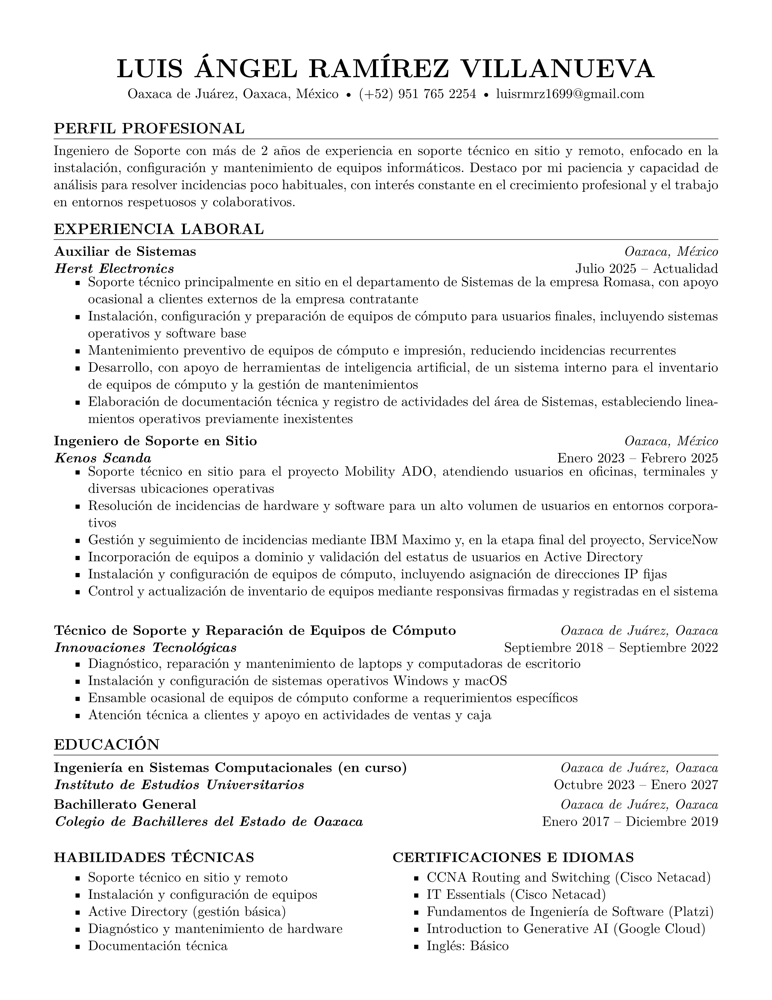

# Currículum Vitae / Resume – Luis Ángel Ramírez Villanueva

Currículum vitae profesional desarrollado en LaTeX.

[](https://github.com/luisrmrz16/resume/releases)

Este repositorio contiene las versiones en español e inglés de mi CV, diseñadas
con un formato limpio, minimalista y compatible con sistemas de seguimiento de
candidatos (ATS).

---

## 📄 Documentos

- `main.tex` → CV en español
- `resume.tex` → Resume en inglés

Ambos documentos se compilan automáticamente mediante GitHub Actions.

---

## ⚙️ Sistema de compilación

La generación de los archivos PDF se realiza a través de **GitHub Actions**, lo
que permite mantener siempre versiones actualizadas sin depender de una
instalación local de LaTeX.

Los PDFs compilados pueden encontrarse en:

**GitHub → Releases → Latest Resume**

---

## 🛠️ Tecnologías utilizadas

- LaTeX
- Visual Studio Code + LaTeX Workshop
- Git & GitHub
- GitHub Actions

---

## ▶️ Compilación local (opcional)

Para compilar manualmente los documentos:

```bash
pdflatex main.tex
pdflatex resume.tex
```

O utilizando cualquier distribución de LaTeX (TeX Live, MiKTeX, etc.).

## 📌 Notas

Este repositorio se utiliza para control de versiones, mejora continua y
generación automatizada de mi currículum vitae profesional.
